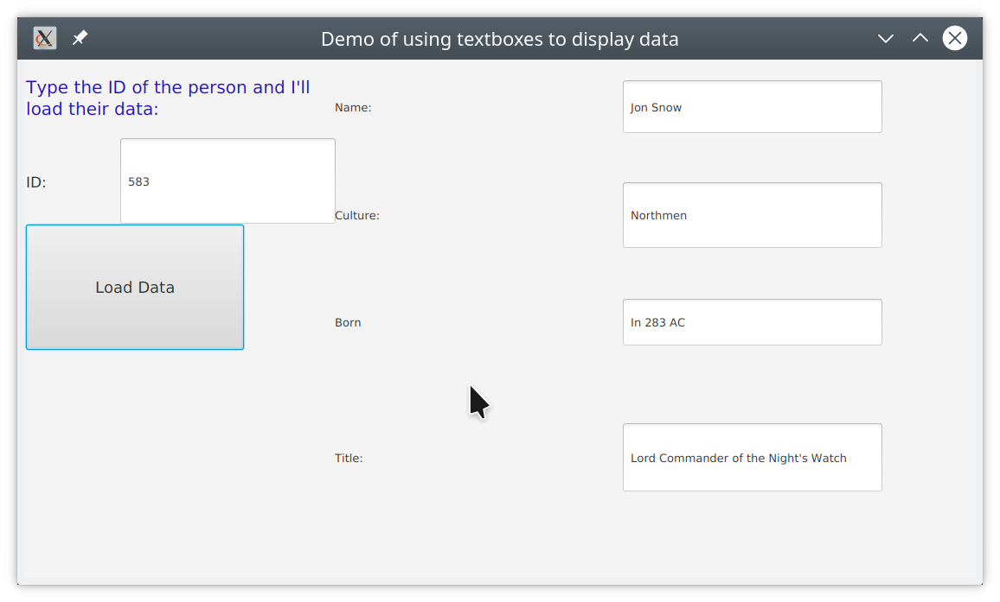

# TextDataDisplayExample
This Repo is intended to be a tutorial for my comp152 class, showing how to put data retrieved from a simple JSON API into a
series of text fields using GSON and JavaFX.

Many of you are working on APIs that only return a single very complex element (The Weather and Star Wars APIs come to mind)
In class we got a list of farily simple recipies back and put them in a ListView. 

But for many of these other APIs it is better to display the data in a series of TextFields instead. In this repository I 
have built a fairly simple MVC based program which does just that after accessing a Game of Thrones API


The View part (DataDisplayDemo.java and Window.fxml) are quite similar to what we have done in class.
The Model part (Model.java) is also similar to the recipe example from class, except that the data class is much more 
complicated than the two simpler versions from the recipe example.

The controller has a much simpler initialize method since I don't need to create a listener for a ListView. 

However have a look at the `displayData` helper function which is called by `loadData`
```
public void displayData(GoTData data){
        //set the data (or at least the part we want) from the Game if Thrones data object
        //into text fields for display.
        NameField.setText(data.name);
        CultureField.setText(data.culture);
        BornField.setText(data.born);
        //some people have many titles,some have none. If there is at least one
        //then use the first one
        if(data.titles.size() >=1)
            TitleField.setText(data.titles.get(0));

    }
```
I think those of you working with APIs that return one large complex object should follow this as your exemplar 
